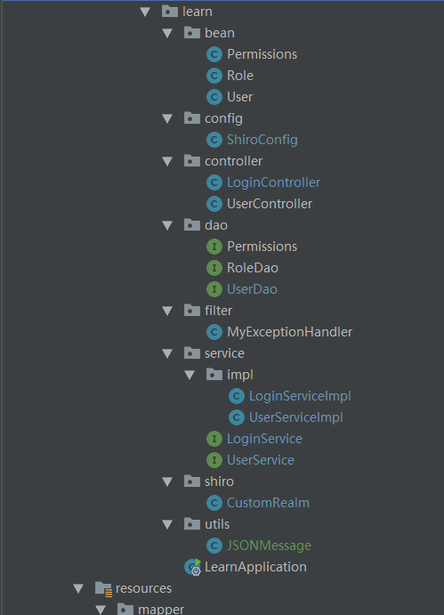

# shiro学习笔记

shiro是Apache下的一个开源项目，属于轻量级安全框架，相对spring security相对简单。

### shiro用户认证流程
1. 创建*SecurityManager*安全管理器
2. 主体*Subject*提交认证信息
3. *SecurityManager*安全管理器认证
4. *SecurityManager*调用*Authenticator*认证器认证
5. *Realm*验证

- Subject（主体）：代表了当前的用户；我们把所有的Subject绑定到SecurityManager，
与Subject的所有交互都委托给SecurityManager；可以把Subject认为是一个门面；SecurityManager才是实际的执行者。  
          
- SecurityManager（安全管理器）：所有与安全有关的操作都会与SecurityManager交互；并且管理着所有subject。

- Realm（域）：Shiro从Realm获取安全数据（用户，角色，权限）。即SecurityManager要进行用户身份验证，必须从Realm中获取
相应的用户进行比较来确定用户身份是否合法。也需要从Realm中得到用户相应的角色/权限来确定用户能否进行相应的操作。可以将Realm看做DataSource，即安全数据源


## shiro用户认证
以本项目为例：  
采用的依赖如下
```
		<dependency>
			<groupId>org.apache.shiro</groupId>
			<artifactId>shiro-spring</artifactId>
			<version>1.4.0</version>
		</dependency>
		
		<dependency>
			<groupId>org.apache.shiro</groupId>
			<artifactId>shiro-core</artifactId>
			<version>1.4.0</version>
		</dependency>
```        
之前使用的是 shiro-spring-boot-web-starter,但是出现了一个bean无法加载的错误，暂时没找到解决的方法。
所以换了依赖包，以后有时间会尝试解决一下那个坑。
项目树如下：  
  
介绍流程采取模块分布：我们首先要写一个shiro的配置文件shiroConfig.java。
我们在里面要配置webFilter来拦截访问我们服务器的所有请求，当然可以设置url的访问权限
```
    @Bean
    public ShiroFilterFactoryBean webFilter() {
        ShiroFilterFactoryBean shiroFilterFactoryBean = new ShiroFilterFactoryBean();
        // Shiro配置类的过滤器中启用安全管理器
        shiroFilterFactoryBean.setSecurityManager(securityManager());

        // 配置拦截链 使用LinkedHashMap，因为LinkedHashMap是有序的，Shiro会根据连接顺序进行拦截
        // Map<K,V> K是指拦截的url，V的值是该url是否被拦截
        Map<String, String> filterChainMap = new LinkedHashMap<>(16);

        //authc:所有url都必须经过认证才能访问：anon：所有url可以进行匿名访问，，先配置anon在配置authc
        filterChainMap.put("/login","anon");
        filterChainMap.put("/**","authc");

        //设置拦截请求后跳转的URL
        shiroFilterFactoryBean.setLoginUrl("/login");
        shiroFilterFactoryBean.setFilterChainDefinitionMap(filterChainMap);

        return shiroFilterFactoryBean;
    }
```
这个webFilter要做几个事:
1. 启用SecurityManager,参数是自己定义好的一个bean。
2. 配置拦截链，使用LinkedHashMap来做容器存放需要进行拦截的url和对应的拦截力度。  
    拦截力度分为两种，都是shiro内置好：
      
    1. anon：允许用户对url进行匿名访问，即不需要验证身份即可访问
    2. authc：需要用户身份验证通过后才可以访问   
    
    另外，之所以是拦截链，拦截优先级与配置时的前后顺序有关。这一点不确定，等查完相关资料之后在进行更新。  
3. 设置跳转的url，当用户匿名访问服务器其他url时进行跳转，一般设为登录所要的url。
4. 可以根据需求添加其他功能：比如说允许将用户的信息写入session中，或者是设置缓存、方便获得用户的基本信息。  

在配置文件中还要设置几个bean，比如上文提到的SecurityManager。
先介绍SecurityManager，这个是shiro的一个核心功能模块，负责对处理与用户(Subject)的所有交互.
```
    @Bean(name = "mySecurityManager")
    public SecurityManager securityManager(){
        DefaultWebSecurityManager securityManager = new DefaultWebSecurityManager();
        //将自定义的Realm交给SecurityManager管理
        securityManager.setRealm(customRealm());
        return securityManager;
    }
```
主要就是设置安全数据源，也就是Realm。这个realm一般自己定义，里面包括了用户、角色和权限的相关信息。
配置好realm之后，在进行用户认证或授权时，SecurityManager会根据realm的信息来判断用户(subject)的角色和权限。

在shiroConfig中还有一个重要的bean就是Realm了
```
    @Bean
    public CustomRealm customRealm() {
        return new CustomRealm();

    }
```

CustomRealm是我们自己定义的，之所以写这个bean是因为无法直接new一个realm
（可能可以，但之前不知道为什么因为直接new CustomRealm()踩了一个坑，具体情况有时间再做补充）  
让我们看看realm的定义
```java
public class CustomRealm extends AuthorizingRealm {
    @Autowired
    private LoginService loginService;

    @Autowired
    private UserService userService;

    @Override
    protected AuthorizationInfo doGetAuthorizationInfo(PrincipalCollection principalCollection) {
        //获取登录用户名
        String username = (String) principalCollection.getPrimaryPrincipal();
        JSONObject jsonObject = new JSONObject();
        jsonObject.put("username",username);
        //根据用户名去数据库查询用户信息
        final User user = userService.getUserByName(jsonObject);
        //添加角色和权限
        SimpleAuthorizationInfo simpleAuthorizationInfo= new SimpleAuthorizationInfo();
        for(Role role :user.getRoles()){
            //添加角色
            simpleAuthorizationInfo.addRole(role.getRoleName());
            //添加权限
            for(Permissions permissions : role.getPermissions()){
                simpleAuthorizationInfo.addStringPermission(permissions.getPermissionName());
            }
        }
        return simpleAuthorizationInfo;
    }

    @Override
    protected AuthenticationInfo doGetAuthenticationInfo(AuthenticationToken token) throws AuthenticationException {
        // 1. 获取用户输入的账号
        String username = (String) token.getPrincipal();

        JSONObject jsonObject = new JSONObject();
        jsonObject.put("username",username);

        // 2. 通过username从数据库中获取到user的实体
        User user = userService.getUserByName(jsonObject);;
        if(null == user){
            return null;
        }
        // 3. 通过SimpleAuthenticationInfo做身份处理
        // 该构造方法的第一个参数是 从数据库获取的User对象
        //           第二个参数是 数据库获取的密码
        //           第三个参数是 当前Realm的名称
        SimpleAuthenticationInfo simpleAuthenticationInfo =
                new SimpleAuthenticationInfo(user,user.getPassword(),user.getUsername());

        // 4. 应该验证用户账号状态：比如说已被禁用则不能登录 但是这里暂不考虑

        // 5. 返回用户身份信息
        return simpleAuthenticationInfo;

    }
}

```

定义一个realm 只要继承一个抽象类AuthorizingRealm，重写里面的两个重要的抽象方法即可。

**doGetAuthenticationInfo()** 进行用户认证的方法，主要过程如下：
1. 从token中获取登录用户的username，然后根据该username去数据查看是否有对应的用户数据，
    如果有，则将用户信息封装到授权信息类simpleAuthenticationInfo里面，然后返回该类。
    


**doGetAuthorizationInfo()** 进行授权的方法，会在该方法内根据用户角色和角色对应的permission来对用户配置。


